# Agent Browser feature guide

These screenshots are generated by the Playwright feature tests in `tests/app.spec.ts`.
Run `npx playwright test` from the `agent-browser/` directory to refresh them.

## Key capabilities

- Local model installation and usage: Settings lets users search browser-runnable ONNX models, load them for local inference, and use installed models from the chat composer.
- In-browser terminal with isolated filesystem: Terminal mode runs `just-bash` in the browser, with each terminal session using its own sandboxed in-memory filesystem.
- Feature-gated sandbox tool execution: when `VITE_SECURE_BROWSER_SANDBOX_EXEC=true`, chat can run a `/sandbox ...` tool request inside a hidden sandboxed iframe, summarize structured results, and persist successful generated files into the active workspace `just-bash` filesystem.
- Virtual filesystem per workspace: The Files category renders as a compute surface, mounts workspace-root and top-level directories as drives, and merges persisted workspace files with per-terminal filesystem trees per workspace.
- Workspace switching and creation: `Research` and `Build` are separate workspaces, and users can switch, cycle, rename, or create workspaces without losing workspace-scoped state.
- Active document surfaces versus media surfaces: The prototype already opens browser tabs and workspace files as first-class content surfaces. In the broader product model, text-like docs are active or editable surfaces, while audio, PDF, DOCX, image, and video assets are viewer or playback surfaces rather than text editors.

## Workspace shell

Playwright test: `captures the main workspace screen`

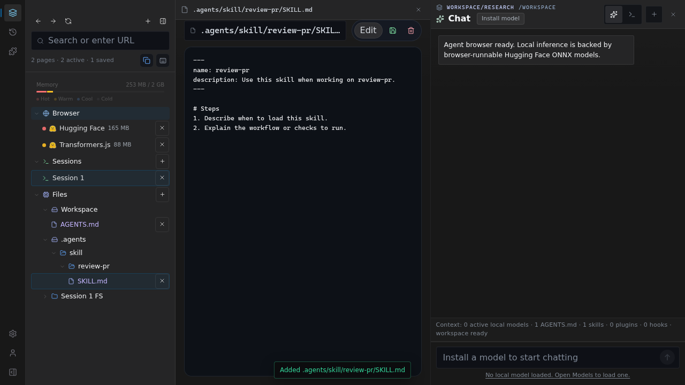

## Startup resilience

Playwright test: `captures startup render without crypto.randomUUID`

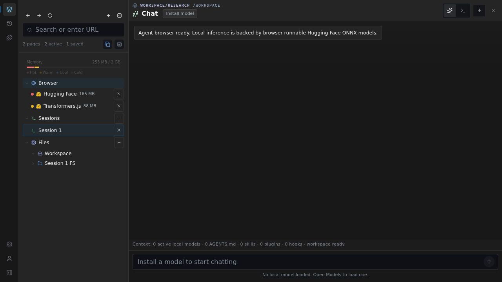

How to interact:
- The sidebar shows the **active workspace root** with its Browser, Terminal, Agent, and Files categories in a compact tree.
- Click the workspace root or any category folder to expand or collapse that part of the tree.
- Click a tab in the active workspace to open it as a page overlay.
- Click the **+** button next to the active workspace to add files (AGENTS.md, skill, plugin, hook) directly into the mounted drives under Files.
- Click a file node in the tree to open the **file editor** in the content area.
- Use the omnibar to search or navigate.
- Use the **workspace pill toggle** under the omnibar to open the workspace overlay.
- Use the **?** button next to it to open the screenshot-style hotkeys modal.
- Type directly while focused in Workspaces to incrementally filter the tree.
- Send a prompt from the composer at the bottom using the model pill and Send button.

## Chat composer

Playwright test: `captures the chat panel with composer`

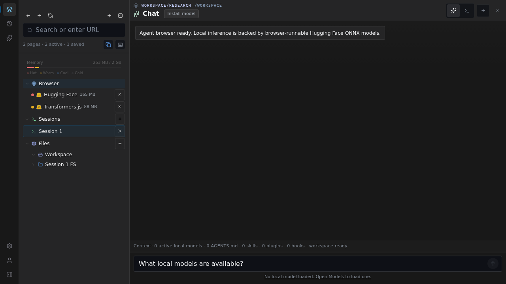

How to interact:
- Type a message in the chat composer textarea.
- Select an installed local model from the model pill dropdown.
- Click the **Send** button or press Enter to submit.
- The chat header stays compact and keeps the current workspace context visible without a large hero block.

## Sandbox tool execution

Playwright test: `captures a sandbox tool run and persists generated files`

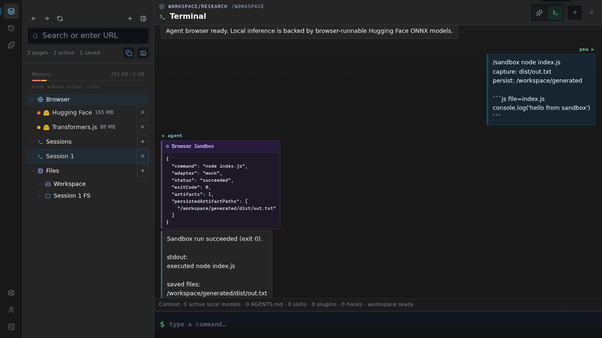

How to interact:
- Enable the feature with `VITE_SECURE_BROWSER_SANDBOX_EXEC=true`.
- Send a `/sandbox ...` prompt from the chat composer with fenced files plus optional `capture:` and `persist:` directives.
- The run executes inside a hidden sandboxed iframe and returns structured output to the main app as plain text plus a tool card summary.
- Successful captured artifacts can be written into the active workspace `just-bash` filesystem, where they appear under the Files category for that session.
- The current default keeps `allow-same-origin` off unless separately enabled, so the sandbox uses the narrowest browser boundary first and only opts into WebContainer-specific permissions when explicitly configured.

## Settings / model registry

Playwright test: `captures the settings screen`

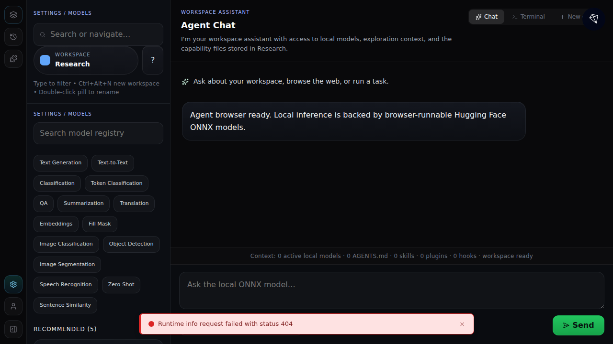

How to interact:
- Open **Settings** from the bottom of the activity bar.
- Use the search field and task chips to browse browser-runnable ONNX models.
- Search the registry across all supported browser models, then optionally narrow results with the task chips.
- Use the Load button on a result card to install a model for local inference.

## Extensions panel

Playwright test: `captures the extensions screen`

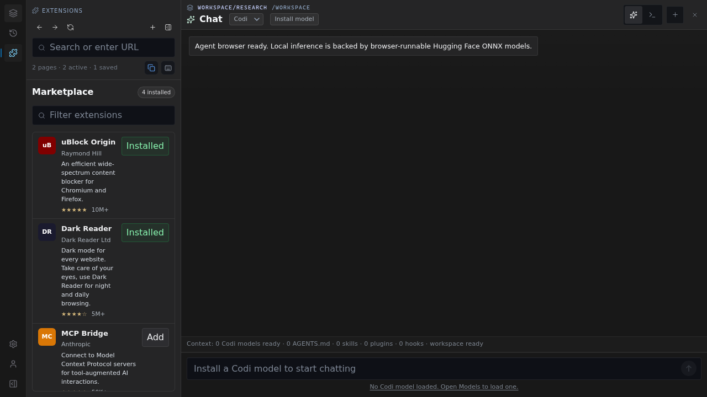

How to interact:
- Open **Extensions** from the activity bar.
- Review which plugin manifests were discovered from the active workspace.
- Return to **Workspaces** when you need to add or edit plugin manifest files.

## History panel

Playwright test: `captures the history screen`

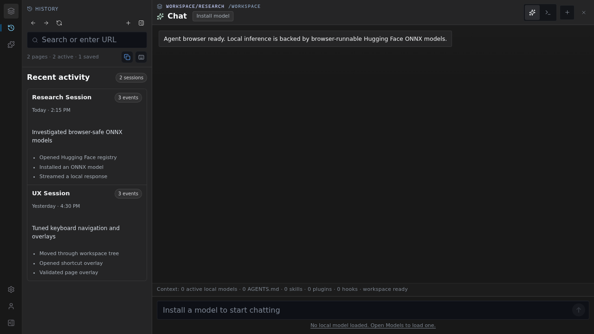

How to interact:
- Open **History** from the activity bar.
- Review recent sessions as compact activity rows.
- Scan event counts, summaries, and session details before resuming work.

## Page overlay

Playwright test: `captures the page overlay when opening a tab`

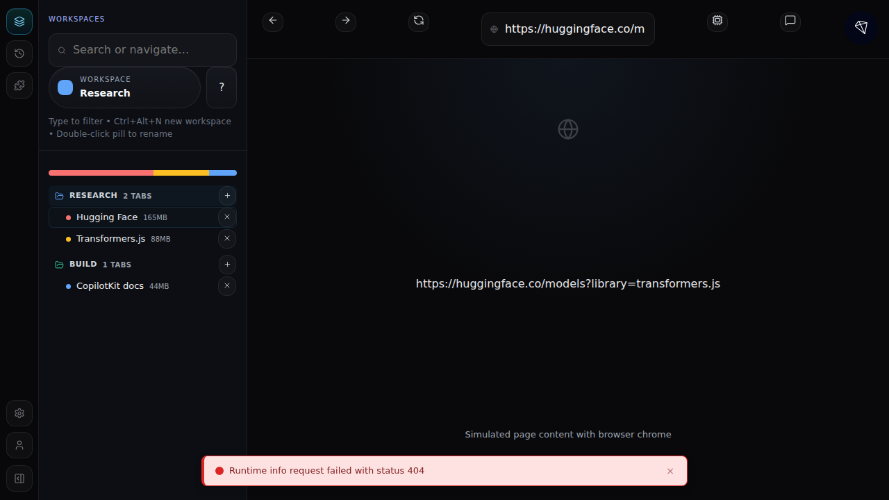

How to interact:
- Click any tab in the workspace tree to open it as a page overlay.
- Use the address bar and navigation controls (back, forward, refresh) at the top.
- Toggle the element inspector or page chat panel from the toolbar buttons.
- Page overlays are workspace-scoped, so switching away and back restores the last open page for that workspace.
- Close the overlay to return to the main chat view.

## Workspace switcher

Playwright test: `captures the workspace switcher modal`

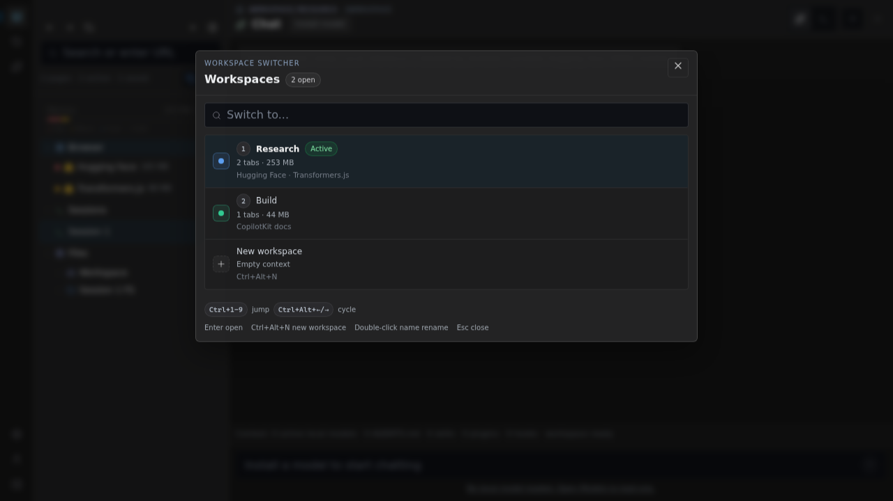

How to interact:
- Click the **workspace pill toggle** to open the switcher modal.
- Search workspaces from the top of the overlay.
- Each workspace row is rendered as a dense quick-pick entry with its jump hint, tab count, and memory usage.
- Click a workspace row to switch to it and close the modal.
- Use **Ctrl+1…9** to jump directly, **Ctrl+Alt+←/→** to cycle, and **Ctrl+Alt+N** to create a new empty workspace.
- Double-click the workspace pill (or a workspace row) to rename a workspace.

## Keyboard shortcuts

Playwright test: `captures the keyboard shortcuts modal`

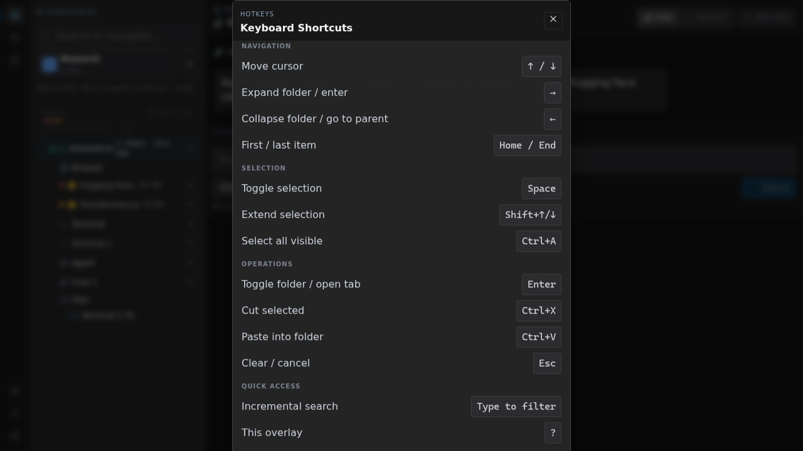

How to interact:
- Press **?** at any time to open the keyboard shortcuts overlay.
- Use **↑ / ↓** to move the tree cursor, **→** to expand/enter, **←** to collapse/go to parent, and **Home / End** for first/last item.
- Use **Space**, **Shift+↑/↓**, and **Ctrl+A** for selection.
- Use **Enter**, **Ctrl+X**, **Ctrl+V**, and **Esc** for operations.
- Use **Type to filter** for incremental search.
- Use **Alt+1-5** to jump between Workspaces, History, Extensions, Settings, and Account.
- Use **Ctrl/Cmd+`** to toggle between the chat panel and terminal mode.
- Use **Ctrl+1-9**, **Ctrl+Alt+←/→**, **Ctrl+Alt+N**, and **Double-click pill** for workspace switching/management.
- Press **Escape** to close the overlay.

## Sidebar collapsed

Playwright test: `captures the sidebar collapsed state`

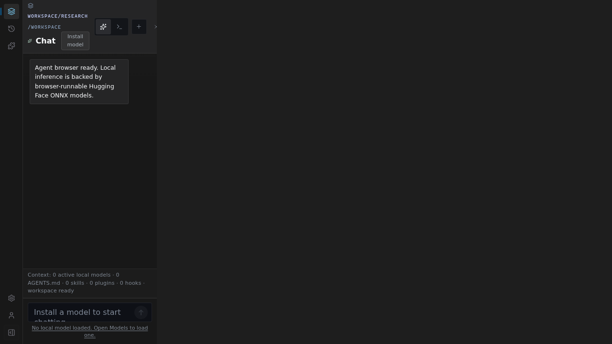

How to interact:
- Click the sidebar toggle button at the bottom of the activity bar to collapse or expand.
- When collapsed, the full width is available for the chat or page overlay panel.
- The activity bar remains visible for quick navigation.

## Omnibar navigation

Playwright test: `captures omnibar URL navigation creating a new tab`

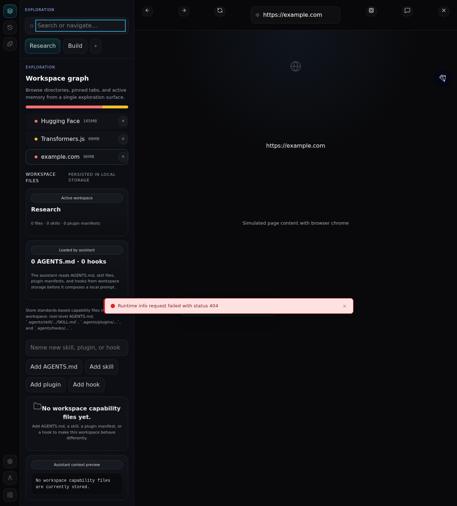

How to interact:
- Type a URL in the omnibar and press Enter to open it as a new tab.
- The page overlay opens immediately with the simulated browser chrome.
- Search queries (non-URLs) are forwarded to the assistant as a web search request.

## Workspace file editing

Playwright test: `captures workspace file edit and delete flow`

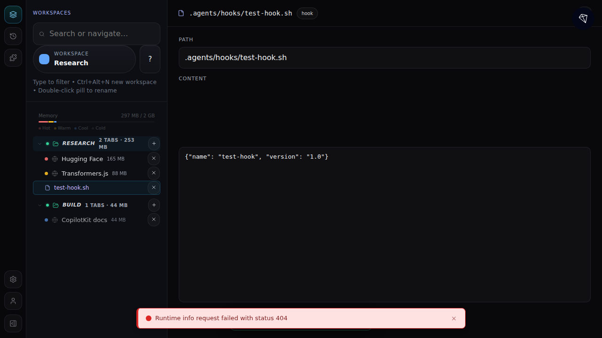

How to interact:
- Click the **+** button on a workspace node in the tree to add files directly as tree items.
- Click a file node in the tree to open the **file editor** in the main content area.
- Edit the path in the compact path bar, change content in the editor surface, then click **Save file** to persist to browser storage.
- Click **Delete file** to remove a file from the workspace.

## Workspace switching

Playwright test: `captures workspace switching via pills`

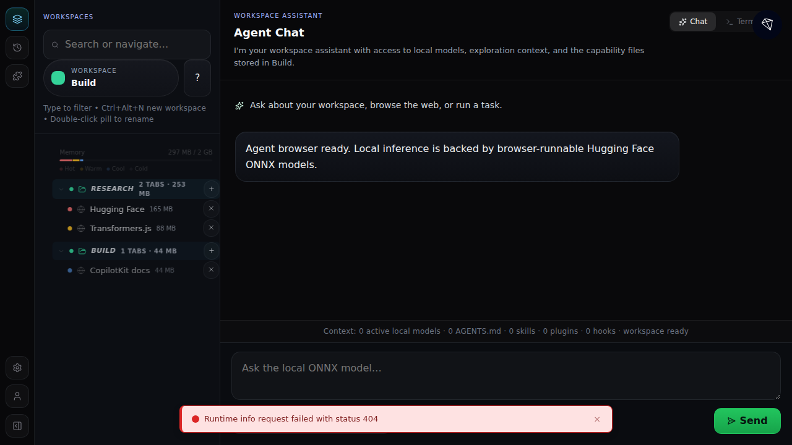

How to interact:
- Click the workspace pill toggle to open the workspace overlay, then choose a workspace.
- Use **Ctrl+Alt+←/→** to switch with the keyboard — the direction of the slide matches the spatial position, and cycling wraps around at the ends.
- Use **Ctrl+1…9** to jump directly by workspace position.
- Use **Ctrl+Alt+N** to create a new empty workspace and **Double-click pill** to rename the current workspace.
- Each workspace has its own tabs, files, terminal/chat sessions, and restored page overlays.
- The workspace tree highlights the active workspace and file nodes follow the active workspace context.
